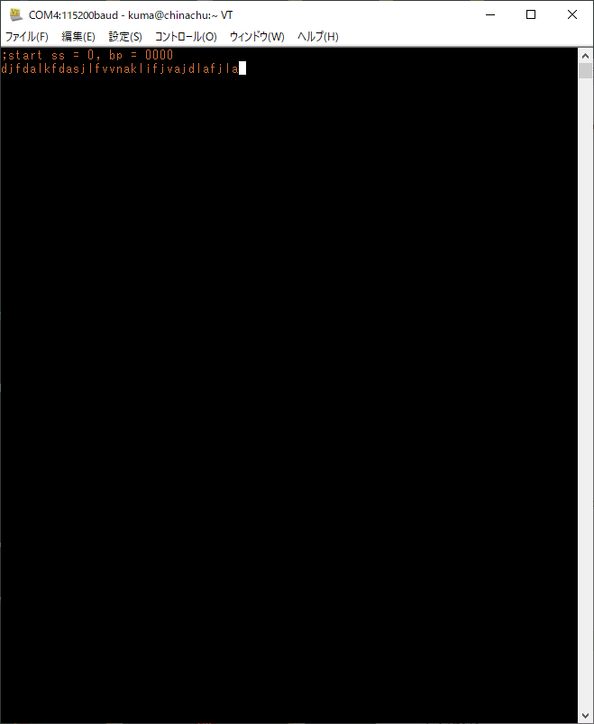
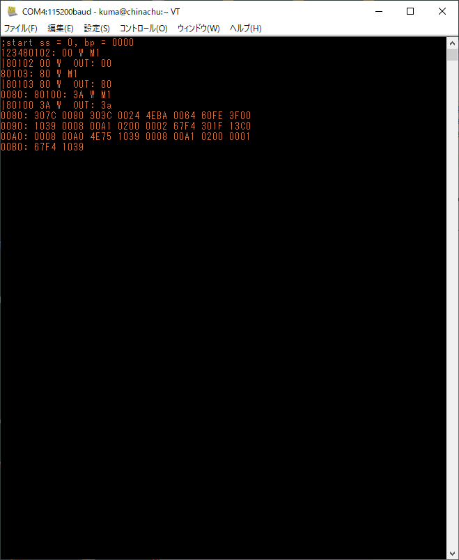

# Mooreの旅路をたどる

> あなたとコンピュータはプログラムを書けますか? 既存のプログラムから派生したのではないプログラムを書けますか? 少しは勉強になるし、やってみるととても楽しいよ。(9章)

日ごろ使いなれたコンパイラも、何もないところから勝手に湧いてきたわけではない。誰かが別の(既に動作する別の)マシンで作ったもののはずだ。どんなマシンも最初は何もない状態のはずで、そのうえで「既存のプログラムから派生したのではないプログラム」を書いていこうと思う。Moore師匠が「とても楽しいよ」と太鼓判を押してくれている。

## 私達のコンピュータ

EMU68Kplus、68008と128kB SRAMとシリアルI/Oを搭載したワンボードコンピュータを使っていきます。I/O機能はPICμコントローラが提供してくれているので、この上で「プログラムをロードして実行する」だけの簡単なモニタを用意しました。

### プログラムのロードと実行

リセット直後のプロンプトは`;`(セミコロン)です。この状態で、アドレス指定(`=0080`など)、データ(16進数4桁、`128F`など)を用いてSRAM上にデータを展開し、最後に実行開始(`...`、ピリオド3回連打)を指示する。

EMU68kplusにUSBシリアルケーブルをつなぎ、ホストPC上で端末ソフト(Teratermやminicom)を実行する。アドレス指定コマンドとデータを含むテキストファイル(`*.X`)を用意して、テキストファイルのアップロード機能を使いそれをEMU68kplusに送り込む。そのあとピリオド3つを連打して実行を開始する。この繰り返しでプログラム実行を繰り返しプログラムを作ってゆく。

テキストファイルの例: エコーバックプログラム

```
=0 0000 1000
=4 0000 0080
=80 4eba 0008
=84 4eba 001c
=88 60f6
=8a 3f00
=8c 1039 0008 00a1
=92 0200 0002
=96 67f4
=98 301f
=9a 13c0 0008 00a0
=a0 4e75
=a2 1039 0008 00a1
=a8 0200 0001
=ac 67f4
=ae 1039 0008 00a0
=b4 4e75
```

実行結果: アドレス指定とデータはエコーバックされないので端末上に痕跡を残さない。ピリオド3発もエコーバック無しです。`start ss = 0, bp = 0000`のあとはターゲットプログラム実行の結果です。



## コンピュータに慣れる

> さて、あなたは今、コンピュータと向き合っている。どうするんだ? まず練習です。コンピュータを起動したら、無限ループを実行するように割り込み位置を初期化しなさい。いいかい?  それからループを修正してメモリをクリアするようにします。いいですか? おそらく多くのことを学んだことでしょう。 (9.1章)

BIOSはおろか、ブートローダもなにもない。1バイト目からフロントパネルのスイッチをぱちぱちして入力してRUNスイッチを押すしかない、そんなコンピュータを前にして、最初にやることは、コンピュータに慣れること。

Moore師匠当時のコンピュータはフロントパネルにアドレスバス・データバス状態を示すLEDがあり、それの点滅やシングルステップで実行を見ることができたのでした。

実は、私も1981年に自分で「スイッチぱちぱち」のコンピュータをくみ上げて使い始めていました。が、これが結構つらいのです。結局PC8801を買ってからはそちらにひよってしまってしまったのでした。なので、今回もスイッチぱちぱちから始めるというのはやめておきます。代わりにシングルステップを使うことにします。

EMU68kplusには割り込み機能はありません(今のところは)。よって、単純な無限ループを組みます。

```
    .org     0
loop:
    bra     loop
    /* end */
```

アップロード用ファイルは、
```
=0 6000 fffe
```

実行結果は、シングルステップで見ます。


メモリクリアは、

```
(シングルステップ、ダンプを動くようにしてから埋める)
```

## 辞書(ディクショナリ)

> さて、これからが本番です。まだ使うことはできないにしても、辞書の構築を開始します。ここでエントリの形式を選びます。可変長エントリは必須ですが、それでも、ワードサイズとレイアウトはあなたが決めることができます。

既にあるライブラリを頼まず、一から手組みで「オレのシステム」をくみ上げてゆくこの取り組みで、データ・ルーチンに名前を付け呼び出せるようにする仕組みの基本が「辞書(ディクショナリ)」です。ロジカルには、「名前とバイト列のペアをエントリとする」「定義した順にエントリをリストにつなぎ、検索は最新のエントリから最初のエントリにさかのぼってゆく」がその定義で、登録・検索も単純なルーチンで実現できます。

```
(辞書の定義を書いて行く)
```

## SAVE, LOAD, DUMP

> 最初のエントリはSAVEで、これはプログラムをディスクに保存します。コントロールループがないので、手動でジャンプしなければなりませんが、少なくとも、多くの作業をやり直すことは最小限に抑えられます。2番目の項目はLOADで、ディスクからプログラムを再ロードします。ハードウェアのロードボタンがあるかもしれませんが、それと互換性を持ってプログラムを保存できるのであれば、それはそれで結構です。そうでなければ、ロードカードにパンチして初期ロードを提供するのがよいでしょう。しかし、コアから再スタートできるのは常に便利なことです。 

いやあんた、EMU68kplusには外部ストレージがないやんか。SAVEもLOADもないやろう。ということで少し困りました。

ここで想定している操作は、
* 以前作ったプログラムをRAM上にLOADする。
* スイッチぱちぱちで追加入力、ルーチン呼び出し、シングルステップやレジスタウォッチを使いデバッグする。
* 作業が一区切りしたらRAMイメージをディスクにSAVEする。

だと思います。ここでは、
* 以前保存しておいたバイナリイメージを母艦PCからRAM上にアップロードする。
* ルーチン呼び出し、シングルステップを使いデバッグ。
* 但しプログラム修正はアセンブラソースコードを修正して再アセンブルする。
* 修正プログラムのデバッグは、再アセンブル結果をRAM上にアップロードする。

とします。EMU68kplus上でプログラム変更しないので、モニタの機能だけで作業を進めることができます。

外部ストレージがまだないことと、バイナリを手で修正してデバッグというのも辛いので、ひよってしまいました。すみません。

> 3番目のエントリはDUMPで、これはコアをプリンタにダンプします。スイッチで見るよりずっと速いので、それほど速くなくてもよいでしょう。このルーチンはおそらく自明なものではありませんが、12命令以上かかることはないはずです。ほんの少し延期してもいいかもしれません。 

せめてこれぐらいはちゃんとやろうと想い、DUMPルーチンを作りました。

```
/*
 * dodump
 * hex dump a region of RAM storage
 * %a0: begin address
 * %d0: count
 */
dodump:
    move.w  %a1,-(%a7)      /* push %a1 */
    move.w  %d1,-(%a7)      /* push %d1 */
    move.w  %d0,%d1         /* %d1: loop counter */
    move.w  %a0,%a1         /* %a1: address pointer */
    move.w  %a0,%d0
    and.w  #0xfffe,%d0     /* address should be even */
    move.w  %d0,%a1
    and.w   #0xfff0,%d0        /* %d0: actual start address */
    /* type initial address */
    move.w  %d0,(dbg_port+2)
    jsr     (puthex4)
    move.b  #':',%d0
    jsr     (putch)
    jsr     (bl)            /* type a blank */
    /* check skip words */
dodump1:
    /* prefix five spaces */
    move.b  %d0,(dbg_port)
    move.w  %a1,%d0
    and.w   #0xf,%d0         /* %d1 = %a1 & 0xf, skip count */
dodump2:
    beq.b   dodump3         /* if zero, end of five spaces */
    /* five spaces */
    jsr     (bl)
    jsr     (bl)
    jsr     (bl)
    jsr     (bl)
    jsr     (bl)
    sub.w   #2,%d0
    bge.b   dodump2
dodump3:
    /* check loop counter */
    and.w   %d1,%d1         /* check loop counter */
    beq.b   dodump4
    /* word dump loop */
    move.w  %a1,%d0
    and.w   #0xf,%d0
    bne.b   dodump5         /* skip typing address */
    /* type address */
    move.w  %a1,%d0
    jsr     (puthex4)
    move.b  #':',%d0
    jsr     (putch)
    jsr     (bl)
dodump5:
    /* put word */
    move.w  (%a1),%d0
    jsr     (puthex4)
    jsr     (bl)
    add.w   #2,%a1
    /* check eol */
    move.w  %a1,%d0
    and.w   #0xf,%d0
    bne.b   dodump6     /* to tail check */
    /* put crlf */
    jsr     (crlf)
dodump6:
    sub.w   #2,%d1
    bge.b   dodump3
dodump4:
    /* all dump over, closing process */
    move.w  %a1,%d0
    and.b   #0xf,%d0
    beq.w   dodumpx
    /* do crlf if address %15 != 0 */
    jsr     (crlf)
dodumpx:
    /* pop registers */
    move.w  (%a7)+,%d1      /* pop %d1 */
    move.w  (%a7)+,%a1      /* pop %a1 */
    rts
```

これのどこが12命令やねん。うーん。たぶん、もともとMoore師匠が想定していたのは、アドレスもなく単に16進変換して出力するだけなんでしょうねぇ。ここで私は頑張りました。結果は以下の通りです。だいたいよく見る見慣れた形式にしています。



## メッセージバッファ

> プログラムをLOADし、コアをDUMPすることができますね。そろそろスイッチから離れ、タイプライタを使うべき時です。メッセージバッファをセットアップして、そこからテキストを送受信できるようにしましょう。 おそらく、テキスト入力を待っている間、あなたのプログラムはどこかで無限ループに陥っているはずです。そのループを認識できるようになりましょう。実行時間のほとんどをそこで過ごすことになるのですから、すべてがうまくいっていることを知ることは心強いことです。 

メッセージバッファを作ります。テキスト入力を待ち、入力された文字をバッファに蓄えてゆきます。

#TIB: 入力テキストの現在のカウントとアドレス  
TIB: 入力テキストバッファの先頭アドレス (#TIB+2, #TIBの先頭アドレスには文字バッファのカウント有効な長さが入っている)  
QUERY: 端末から文字入力を受け、入力バッファに蓄える。  

eForthでは accept (b u -- b u)...バッファ先頭と文字数を渡し、入力が完了すると入力文字数を返す


```
(辞書エントリヘッダ - eForthの形式をそのまま使用)
Token   2 bytes  code address (ca)
Link    2 bytes  name address (na) of previous word
Length  1 byte   length and lexicon bits
Name    n bytes  name of word
Filler  0/1 byte fill to cell boundary
```