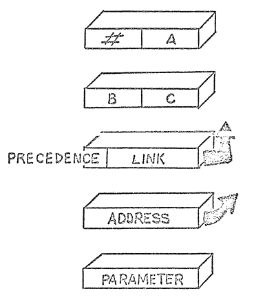
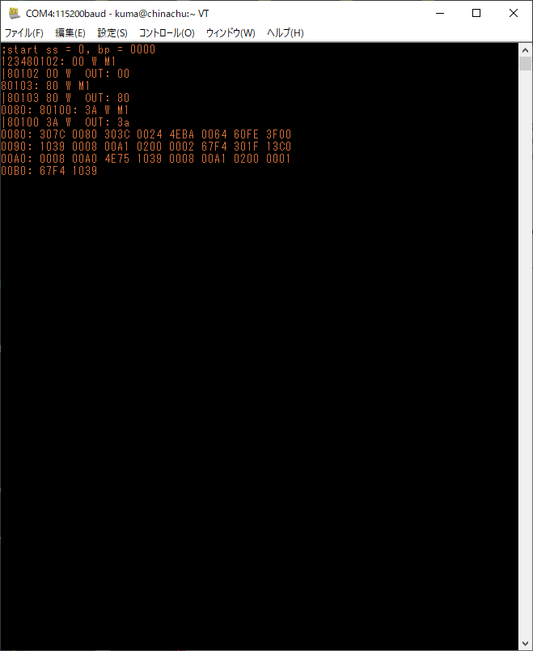

# 3章 旅立ち

[PROGRAMMING A PROBLEM ORIENTED LANGUAGE, Moore, 70b](http://www.forth.org/POL.pdf)は、Moore師匠が1970年に書いた文書である。自前の環境を10年使い続けて、開発環境とアプリケーション構築に関する彼の考えを説明している。この文書はFORTHという開発環境そのものの説明だが、この9章は、新しいマシンを前にしてこの環境をどのようにして構築してゆくか、のあらすじをざっと説明している。

移植ではない、構築なのだ。別のアーキテクチャのCPUをまたいで生きてゆかねばならないのだから、共通のディスクアクセス機構、共通のOS、共通のライブラリを前提として「移植」することは期待できない。下手するとアセンブラさえ使えない環境、機械語をぱちぱち打ち込んで実行するだけの環境に、自分の手元にある環境一式を「構築」してゆく。これまで頼りにしていたものすべてから切り離され、生きてゆかねばならない、そんな気持ちがするかも。「月は地獄だ」「Dr. STONE」「サバイバル」そんな作品を思い出しながら、彼のたどった道を自分の足で歩いてみたい。そんな気がするのだ。

以下では、9章の文言を引用しながら、私が歩いた道筋を説明してゆく。よろしければ、ご自分で好きなCPUを選んで実行環境をつくっていただいても構わない。

## まず練習だ

> さて、あなたは今、コンピュータと向き合っている。どうするんだ? まず練習です。コンピュータを起動したら、無限ループを実行するように割り込み位置を初期化しなさい。いいかい?  それからループを修正してメモリをクリアするようにします。いいですか? おそらく多くのことを学んだことでしょう。 (9.1章)

BIOSはおろか、ブートローダもなにもない。1バイト目からフロントパネルのスイッチをぱちぱちして入力してRUNスイッチを押すしかない、そんなコンピュータを前にして、最初にやることは、コンピュータに慣れること。

Moore師匠当時のコンピュータはフロントパネルにアドレスバス・データバス状態を示すLEDがあり、それの点滅やシングルステップで実行を見ることができたのでした。

実は、私も1981年に自分で「スイッチぱちぱち」のコンピュータをくみ上げて使い始めていました。が、これが結構つらいのです。結局PC8801を買ってからはそちらにひよってしまってしまったのでした。なので、今回もスイッチぱちぱちから始めるというのはやめておきます。代わりにシングルステップを使うことにします。

EMU68kplusには割り込み機能はありません(今のところは)。よって、単純な無限ループを組みます。

```
    .org     0
loop:
    bra     loop
    /* end */
```

アップロード用ファイルは、
```
=0 6000 fffe
```

実行結果は、シングルステップで見ます。


メモリクリアは、

```
(シングルステップ、ダンプを動くようにしてから埋める)
```

## 辞書(ディクショナリ)

> さて、これからが本番です。まだ使うことはできないにしても、辞書の構築を開始します。ここでエントリの形式を選びます。可変長エントリは必須ですが、それでも、ワードサイズとレイアウトはあなたが決めることができます。

既にあるライブラリを頼まず、一から手組みで「オレのシステム」をくみ上げてゆくこの取り組みで、データ・ルーチンに名前を付け呼び出せるようにする仕組みの基本が「辞書(ディクショナリ)」です。ロジカルには、「名前とバイト列のペアをエントリとする」「定義した順にエントリをリストにつなぎ、検索は最新のエントリから最初のエントリにさかのぼってゆく」がその定義で、登録・検索も単純なルーチンで実現できます。

> エントリには、定義されるワード、実行されるコード、次のエントリへのリンク、パラメータの4つのフィールドがあります。それぞれについて説明する。 
>
> ワードの形式はワード入力ルーチンとともに決定されなければならない。ワードのサイズは固定で、NEXTで定義されたサイズより小さくてもよいが、ハードウェアのワードサイズの倍数でなければならない。 しかし、より洗練されたアプリケーションは、出力メッセージを構築するために辞書のワードを使用する。その場合、ワードを切り詰めないことが重要であり、その場合、ワードフィールドは可変長でなければならない。このフィールドのサイズをマークするために、文字カウントではなく、空白文字を使用する必要がある。可変エントリ内で可変ワードフィールドを扱うには、ワードは一方向に(後方に)、パラメータは他方向に(前方に)伸びる必要があります。固定または可変ワードサイズのどちらを選ぶかは、基本原則の適用が必要です。 
>
> コードフィールドには、テーブルや他の省略形へのインデックスではなく、ルーチンのアドレスを入れるべきです。プログラムの効率は、3.9で説明するように、エントリが特定された後、コードにたどり着くまでの時間に強く依存します。しかし、プログラムのサイズが小さいと、このアドレスはハードウェアアドレスフィールドより少ないスペースに収まることができます。 
>
> リンクフィールドも同様に、ハードウェアで指定されたものより小さくてもよい。これは、現在のエントリからの距離ではなく、次のエントリの絶対位置を含むべきである。 
>
> パラメータフィールドは、通常4種類の情報を含む。
>
> * 定数または変数で、サイズは可変です。数値の性質は、実行されるコードによって決定されます。 
> * 配列 - 数値が格納されるスペースです。配列のサイズはパラメータであるか、または実行されるコードに含まれているかもしれません。 
> * 定義：仮想のコンピュータ命令を表す辞書の項目の配列。3.9を参照してください。 
> * 機械語命令: プログラムによってコンパイルされたコードで、このエントリが実行される際にこのコードが実行される。このようなデータは、おそらくワード境界でアラインされなければならないが、他はその必要がない。(3.6.1. エントリの形式)

<p style="text-align: center">

図4. 辞書エントリの形式
</p>
```
(辞書の定義を書いて行く)
```

コンパイラ(といっても入力文字列からワードを一つ一つ切り出し、辞書を引いてその名前を持つエントリを検索し、得たエントリのアドレスをメモリ上に並べてゆく)ができるまでは、「手で辞書をコンパイル」します。具体的には、「名前」「属性」「名前の列」を順に並べ、辞書エントリを描くアセンブラプログラムを書きます。

通常のやり方は、マクロアセンブラのマクロ機能を用いて辞書エントリを生成し、本体は「名前の列」のエントリシンボルを書き出して、アセンブラに掛けてオブジェクトを生成し、辞書とします。

ここでは、簡単なテキスト処理プログラムにより、辞書エントリを生成し、アセンブラに掛けるコードを生成させるようにします。名前の前方参照を解決する必要があるので、そこはアセンブラの機能を利用するというわけです。

エントリのデータフィールドには、他のエントリのアドレスが並びますが、アドレスでない要素も並べられるようにします。以下の要素です。
* 定数をスタックに置く要素(Literal): 機械語のイミディエイト命令のように、次の要素を数値とみなしスタックに置きます。ソースコードで定数を書くと、辞書エントリとしてコンパイルするときにこの要素が必要になるのです。
* ブランチ(スキップ)命令: 直後の要素をアドレスとみなし、そこまでジャンプすることを指示する要素です。IF-ELSE-THEN, WHILE 等の制御構造を実現するときに、辞書エントリ内で要素をスキップしたり戻ったりすることが必要になるのですが、それを実現します。無条件ブランチと、条件付きブランチの2種類を用意します。条件付きブランチは、「スタックトップの値がゼロならジャンプする」の一つだけとします。大なり、小なりは、ブランチ命令の前に演算を並べてスタックトップにゼロ/非ゼロの結果を返すことで実現します。 

## SAVE, LOAD, DUMP

> 最初のエントリはSAVEで、これはプログラムをディスクに保存します。コントロールループがないので、手動でジャンプしなければなりませんが、少なくとも、多くの作業をやり直すことは最小限に抑えられます。2番目の項目はLOADで、ディスクからプログラムを再ロードします。ハードウェアのロードボタンがあるかもしれませんが、それと互換性を持ってプログラムを保存できるのであれば、それはそれで結構です。そうでなければ、ロードカードにパンチして初期ロードを提供するのがよいでしょう。しかし、コアから再スタートできるのは常に便利なことです。 

いやあんた、EMU68kplusには外部ストレージがないやんか。SAVEもLOADもないやろう。ということで少し困りました。

ここで想定している操作は、
* 以前作ったプログラムをRAM上にLOADする。
* スイッチぱちぱちで追加入力、ルーチン呼び出し、シングルステップやレジスタウォッチを使いデバッグする。
* 作業が一区切りしたらRAMイメージをディスクにSAVEする。

だと思います。ここでは、
* 以前保存しておいたバイナリイメージを母艦PCからRAM上にアップロードする。
* ルーチン呼び出し、シングルステップを使いデバッグ。
* 但しプログラム修正はアセンブラソースコードを修正して再アセンブルする。
* 修正プログラムのデバッグは、再アセンブル結果をRAM上にアップロードする。

とします。EMU68kplus上でプログラム変更しないので、モニタの機能だけで作業を進めることができます。

外部ストレージがまだないことと、バイナリを手で修正してデバッグというのも辛いので、ひよってしまいました。すみません。

> 3番目のエントリはDUMPで、これはコアをプリンタにダンプします。スイッチで見るよりずっと速いので、それほど速くなくてもよいでしょう。このルーチンはおそらく自明なものではありませんが、12命令以上かかることはないはずです。ほんの少し延期してもいいかもしれません。 

せめてこれぐらいはちゃんとやろうと想い、DUMPルーチンを作りました。

```
/*
 * dodump
 * hex dump a region of RAM storage
 * %a0: begin address
 * %d0: count
 */
dodump:
    move.w  %a1,-(%a7)      /* push %a1 */
    move.w  %d1,-(%a7)      /* push %d1 */
    move.w  %d0,%d1         /* %d1: loop counter */
    move.w  %a0,%a1         /* %a1: address pointer */
    move.w  %a0,%d0
    and.w  #0xfffe,%d0     /* address should be even */
    move.w  %d0,%a1
    and.w   #0xfff0,%d0        /* %d0: actual start address */
    /* type initial address */
    move.w  %d0,(dbg_port+2)
    jsr     (puthex4)
    move.b  #':',%d0
    jsr     (putch)
    jsr     (bl)            /* type a blank */
    /* check skip words */
dodump1:
    /* prefix five spaces */
    move.b  %d0,(dbg_port)
    move.w  %a1,%d0
    and.w   #0xf,%d0         /* %d1 = %a1 & 0xf, skip count */
dodump2:
    beq.b   dodump3         /* if zero, end of five spaces */
    /* five spaces */
    jsr     (bl)
    jsr     (bl)
    jsr     (bl)
    jsr     (bl)
    jsr     (bl)
    sub.w   #2,%d0
    bge.b   dodump2
dodump3:
    /* check loop counter */
    and.w   %d1,%d1         /* check loop counter */
    beq.b   dodump4
    /* word dump loop */
    move.w  %a1,%d0
    and.w   #0xf,%d0
    bne.b   dodump5         /* skip typing address */
    /* type address */
    move.w  %a1,%d0
    jsr     (puthex4)
    move.b  #':',%d0
    jsr     (putch)
    jsr     (bl)
dodump5:
    /* put word */
    move.w  (%a1),%d0
    jsr     (puthex4)
    jsr     (bl)
    add.w   #2,%a1
    /* check eol */
    move.w  %a1,%d0
    and.w   #0xf,%d0
    bne.b   dodump6     /* to tail check */
    /* put crlf */
    jsr     (crlf)
dodump6:
    sub.w   #2,%d1
    bge.b   dodump3
dodump4:
    /* all dump over, closing process */
    move.w  %a1,%d0
    and.b   #0xf,%d0
    beq.w   dodumpx
    /* do crlf if address %15 != 0 */
    jsr     (crlf)
dodumpx:
    /* pop registers */
    move.w  (%a7)+,%d1      /* pop %d1 */
    move.w  (%a7)+,%a1      /* pop %a1 */
    rts
```

これのどこが12命令やねん。うーん。たぶん、もともとMoore師匠が想定していたのは、アドレスもなく単に16進変換して出力するだけなんでしょうねぇ。ここで私は頑張りました。結果は以下の通りです。だいたいよく見る見慣れた形式にしています。



