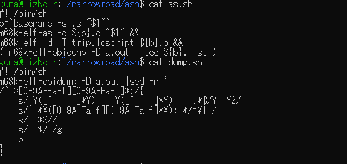
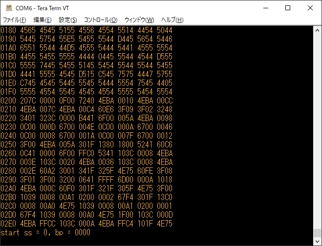

# 実行環境の整備{id=H04-1}

70年当時のミニコン環境を整えます。機械語/アセンブラでの開発がメインで、私個人として経験のない68000を選びました。

今風の開発環境として、SBC(Single Board Computer)とエミュレータソフトウェアを用意しました。SBCは、68008 CPU, 128k SRAM, PIC18F CPUからなる基板です。エミュレータは[Musashi](https://github.com/kstenerud/Musashi)をベースにしました。68000ファミリをFPU/MMUまで備えたなかなかのエミュレータだと思います。

## 70年代の実行環境・開発環境{id=H04-2}

Mooreがたどった道をたどるために、70年当時のミニコン環境に近づけます。CPUとメモリとスイッチパネル、数MByteのハードディスクと、タイプライタ端末、紙テープリーダ・パンチャです。

ミニコン自体は19インチラック1本にCPU/メモリとフロントパネルが刺さっています。磁気テープ装置やハードディスクも含めてラック数本でコンピュータ1台を構成していたようです。オペレータの一人は、**タイプライタ端末**の前に座ってコンピュータを操作するふりをしています。

<figure>
  
  <figcaption aria-hidden="true">図2-1. PDP-11ミニコンピュータ全景(PDP-11の前でポーズを取るDennis RitchieとKen Tompson)
</figcaption>
</figure>

**フロントパネル**: コンピュータを操作するためのスイッチが並んでいます。CPUを止めておくスイッチ、CPU停止中にRAM上に1バイト1バイトデータを書き込んでゆくためのスイッチがならんでいます。

図2-2. [ミニコンPDP-11のフロントパネル](https://arstechnica.com/gadgets/2022/03/a-brief-tour-of-the-pdp-11-the-most-influential-minicomputer-of-all-time/)(実際には、レプリカPiDP-11のパネルです)

当時のミニコンピュータは、電源投入直後にメモリ上にはなにもなく、フロントパネルのスイッチを操作して、0番地から1バイトずつIPLを書き込み、それを実行して実行したいプログラムを紙テープから読み込むというのが使い始めの手続きとなっていました。

具体的にどんな感じで操作するのかは、以下のYouTubeムービーがいい感じを出しています。
[Programming a PDP-11 Through the Front Panel by BitDanz Blog](https://www.youtube.com/watch?v=mAg4NU2uwgo)

ムービーを今すぐ見られない方々のために、いかにざっと説明を書いておきます。

* 機械語(8進数データ)をプリントアウトしておく。
* 先頭アドレス(01000)を下側のスイッチをON/OFFして2進数で設定する。  
  下側のスイッチ(スイッチレジスタ)は数値(アドレス、データ)を入力するためのもので、3個一組で色分けされており、8進数3ビットまとまりのダンプデータの入力が分かりやすくなっています。
* LOAD ADRSスイッチを引き、スイッチの値をアドレスレジスタに設定する。
* スイッチレジスタのスイッチを操作し、データを設定する。
* DEPスイッチを引き、先ほど設定したデータの値をメモリに書き込む。
* (アドレスレジスタの値が自動的にインクリメントされるので)再度スイッチレジスタに次のデータを設定し、DEPスイッチを引くと、2番目のデータが格納される。
  
こうして、1ワード1ワードメモリに打ち込んでゆくのです。

左下のスイッチレジスタ(18個)で8進数を入力します。

右下のコントロールスイッチを使い、アドレス設定、データ書き込みを行います。

各スイッチの説明は以下の通りです。

|スイッチ名|説明|
|--|--|
|LOAD ADRS|スイッチレジスタの内容をバスアドレスレジスタに書き込む。書き込んだ結果がアドレスレジスタ(18bit LED)に表示される。この値を使い、EXAM, DEP, STARTスイッチを押しそれぞれの動作を行う。|
|EXAM (Examine)|バスアドレスがさすメモリの内容をデータレジスタ(16bit LED)に表示する。再度このスイッチを引くと、次のアドレスの内容を表示する。つまり、バスアドレスが自動的にインクリメントされる。|
|DEP (Deposit)|スイッチレジスタの内容をメモリに書き込む。書き込む位置はバスアドレスである。|
|CONT (Continue)|先ほど停止した続きで実行再開する。|
|ENABLE/ HALT|ENABLE: CPUにプログラム実行させる。 HALT: CPUを停止する。スイッチを引くとシングルステップ実行する。|
|START|システムリセット後、プログラムを実行する。|

これで数キロバイト打ち込むのは耐えられないので、「紙テープからをプログラムをロードするプログラム」「ハードディスク先頭からプログラムをメモリにロードするプログラム」(IPL)だけを打ち込み、Fortranコンパイラやアセンブラをロードして実行させていたと思われます。

また、ブートローダをROMで持たせることもできたようで、80年代のPDP-11のマニュアルを見ると、テンキー(実際には8個だけだが)でアドレス・データが入力できるコンソールと、それもなくなり実行開始・停止だけができるコンソールも出てきています。後者はブートローダをROMで持つことが前提になっていることがわかります。

図2-5. [80年代のPDP-11のフロントパネル](https://manx-docs.org/collections/antonio/dec/ek-11034-mc-003.pdf)(上が通常型パネル、下がプログラマー用パネル)

## 今回の実行環境{id=H04-3}

これだけ盛り上げておいて恐縮ですが、今回の実行環境ではスイッチパチパチのパネルは用意していません。大昔に自作コンピュータを操作したときの経験を思い出すと、数十バイトのIPLロードでさえ「やってられねぇ」感しかないからです。申し訳ありません。

SBC版では、起動直後にブートロードモードに入り、シリアルターミナル(Teraterm等)のテキストアップロード機能を用いてダンプデータファイルをアップロードします。

SBC内部のPICのファームウエアがダンプデータファイルをメモリ上に展開し、スタートコマンドを入力するとプログラムを実行します。

エミュレータ版は、Linux コマンドラインプロンプトでダンプデータファイルを引数として与えると、エミュレータ起動時に読み取りメモリ上に展開し、プログラムの実行を開始します。

アセンブル・リンクはいずれにおいてもLinuxプロンプトから、Linuxコマンドのアセンブラ・リンカを起動します。70年代の環境では、

* ブートローダを手で打ち込む。
* 紙テープのアセンブラプログラムを読み込み実行する。
* アセンブラソースコードを紙テープから読み込み、メモリ上に展開する。
* ターゲットプログラムを実行する。

と思われます。かなり面倒なことが想像できます。そういう観点からは今回の「Linuxコマンドでアセンブルする」はかなりのズルかも知れません。

一方、実行開始後は打つ手はありません。デバッガなしでのデバッグとなります。ブレークポイントとシングルステップまで許容してもいいかもしれません。

## 具体的な手順{id=H04-5}

### 1. ソースコードをアセンブルする。{id=H04-6}

`sh as.sh [source-file]`を実行します。以下ではソースコード`accept.s`をアセンブルしています。

アセンブルが完了すると画面にリストファイルが出力されます。

### 2. ダンプファイルに変換する。{id=H04-7}

`sh dump.sh > [dump-file]`を実行します。以下ではダンプファイル`accept.X`を生成しています。

> ### アセンブラとリンカ
> 68000用として、binutilsを68000用にビルドして使っています。
> 
> スクリプト`as.sh`では、アセンブラ`m68k-elf-as`を実行後、リンカ`m68k-elf-ld`で未解決シンボルの解決を行っています。
> 
> スクリプト`dump.sh`では`m68k-elf-objdump`コマンドを使ってダンプファイルを生成後、`sed`によりPICファームウェアがロード可能な形式に変換しています。 

### 3. 実行(SBC版): ダンプファイルをドラッグアンドドロップする{id=H04-8}

SBC(emu68k_plus)を起動する。Teratermに`;`だけのプロンプトが表れる。

この状態で、Windowsのエクスプローラからダンプファイル`accept.X`を掴んで、Teratermにドラッグアンドドロップする。

> WSLのファイルをWindowsエクスプローラで開くには、`\\wsl$\Ubuntu-20.04\home\kuma\....\accept.X`のように、`\\wsl$\Ubuntu-20.04\`を先頭に付けてエクスプローラを開けるとよいようである。

すると、以下のダイアログを出してくるので、OKを押す。アップロードが始まる。

> 8k BASICでも数秒で終わる。さすがに 115200bpsは速い。

アップロードが終わってもTeraterm画面には何も変化がない。アップロード中は読み込みとRAMへの展開に全力を注ぎ、エコーバックは一切行わないのだ。エコーバックを行わないことにより、PICファームウェアは115200bpsで突っ込まれても十分処理できる。

以下の画面はダンプコマンドを叩いたあとの状態です。ダンプコマンドは１文字`!`(びっくりマーク)です。

プログラム実行開始は`...`(ピリオド3個連打)です。`start ss = 0, bp = 0000`と表示され68008のリセットが解除されます。上記の表示は見た目だけでブレークポイントが使えるわけではありません。

今回の例で用いた`accept.X`は行入力ルーチンです。通常文字を受信・エコーバックするとともにバッファに貯めます。`^H`により直前の文字を抹消することができます。行編集コマンドはこれだけです。リターンを押すと入力完了です。このテストプログラムでは入力して得た文字列をそのままダンプしています。よって以下のように同じ表示が2行続くことになります。

